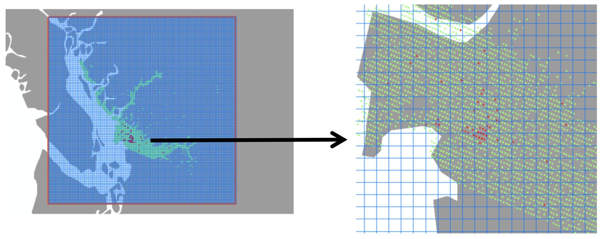
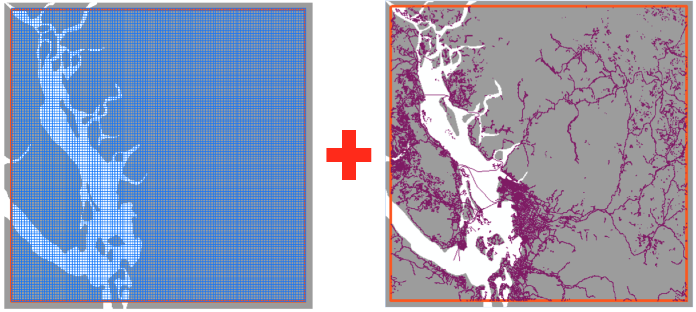
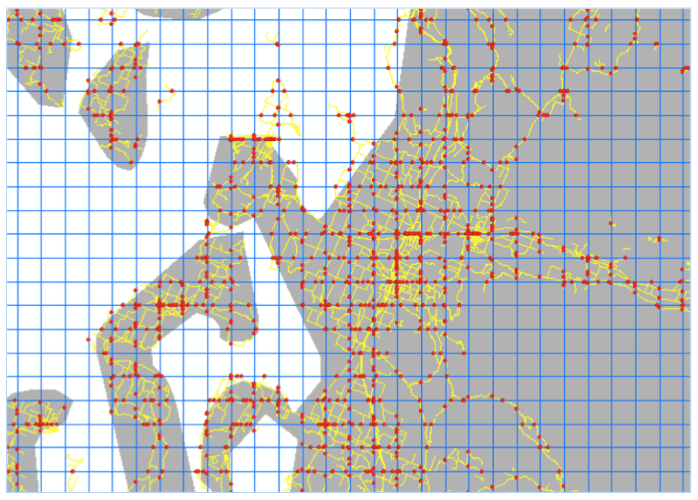
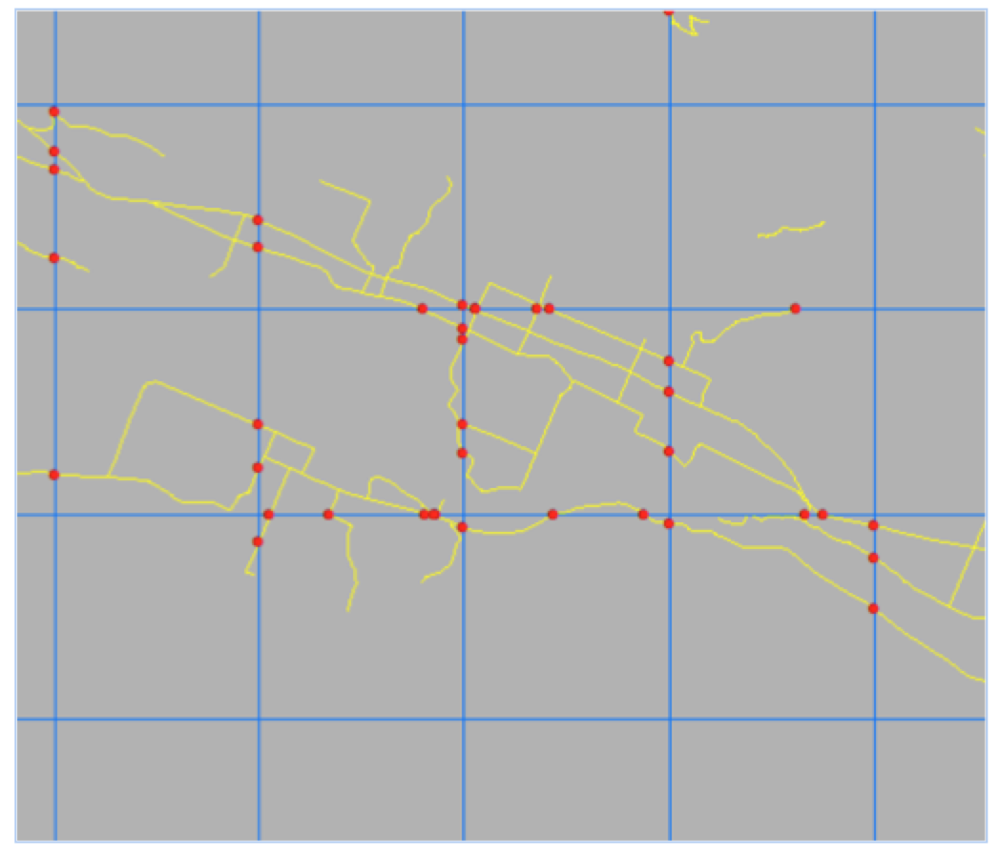

<h1 align="center">:ant: MoRIS input files tutorial</h1>
<p align="center">
J. M. W. Gippet, C. Rocabert
</p>

<br/>
<br/>
This tutorial explains to the user how to build MoRIS input files, in order to perform HMD (Human Mediated Dispersal) parameters estimation.

MoRIS requires 3 input files:
- <strong>The map file</strong>, describing a discretized version of the area of interest, made of "cells" of a given size (<em>e.g.</em> squares, or hexagons, or anything else),
- <strong>The network file</strong>, describing the network connecting cells on the map (<em>e.g.</em> a road network, but any network could work, such as a river system or an aerial system),
- <strong>The sample file</strong>, describing the sampling effort of the invasive species of interest, cell by cell. A presence-absence scheme is required.

## Table of contents
1. [How to build the map file](#map)
2. [How to build the network file](#network)
3. [How to build the sample file](#sample)

## 1. How to build the map file (area of interest)?<a name="map"></a>

### 1.1 File name and structure

By default, the map file must be named `map.txt` (MoRIS offers the possibility to choose optional filenames). The map file is a <strong>list all the cells of the discretized area of interest (one cell by line)</strong>.

Here is an example of the file structure:

```
1 0 0 4000000 4000000
2 2000 0 4000000 4000000
3 4000 0 4000000 4000000
4 6000 0 4000000 4000000
5 8000 0 4000000 4000000
```

- Column 1 contains <strong>cell identifiers</strong>, which must be positive integer numbers (usually from `1` to `n` if the map contains `n` cells),
- Column 2 contains <strong>the x-axis coordinate of the cell</strong>, here in meters. The coordinate of the centroid is preferred,
- Column 3 contains <strong>the y-axis coordinate of the cell</strong>, here in meters. The coordinate of the centroid is preferred,
- Column 4 contains <strong>the area of the cell</strong>, here in square meters,
- Column 5 contains <strong>the suitable habitat area of the cell</strong>, in square meters.

<strong>The separator must be a single space " ". End-of-line symbol must be "\n".</strong>

### 1.2 How to build the file

#### A) Choose an extent.
Define a <strong>working area</strong> (red square on figure 1) around your <strong>area of interest</strong>, namely: the area where you have presence/absence data on your favorite invasive species (red/green dots on figure 1).

This <strong>working area</strong> must be centered around and larger by at least 100% than the invaded part of your area of interest, except for natural barriers (the ocean for example, left/West side on figure 1). Do not underestimate the importance of this <strong>bufferring area</strong>, to avoid estimation biases in MoRIS.

<p align="center">
  <br/>
  
  <br/>
  <strong>Figure 1</strong>
  <br/>
</p>

#### B) Discretize the map.
Define the <strong>shape and resolution</strong> of your fishnet. You can use squares or any other regular shape. On figure 2, squares are 3km large. This is because in this case, the species of interest do not disperse naturally more than 3 kilometers by year. In this case, it is thus assumed that natural dispersal could only allow the colonization of cells that are adjacent to already invaded cells.

<p align="center">
  <br/>
  
  <br/>
  <strong>Figure 2</strong>
  <br/>
</p>

#### C) Extract the information of interest from each cell.
Determine the coordinates of the centroid of each cell. Do not forget to use metric projected coordinate system (such as Lambert93 for France), meters unit is preferred. Also, calculate the area of each cell (3km large squares have areas of 9,000,000m²) and give them a unique ID from `1` to `n` (here `n = 13,689`).

## 2. How to build the network file?<a name="network"></a>

### 2.1 File name and structure

By default, the map file must be named `network.txt` (MoRIS offers the possibility to choose optional filenames). The network file is an <strong>adjacency list of all the links between map cells (one link by line). Cell identifiers must be the same in the map file and the network file</strong>.
The network file then describes how the cells of the map are connected to each other.

More precisely, the network file contains the <strong>undirected graph</strong> (<em>e.g.</em> one line in the file describes an undirected edge between two nodes of the graph) representing the network of interest, discretized to the scale of the map cells. 

Here is an example of the file structure:

```
1 -1 0 0 2 1 0 0
1 2 0 0 1 0 0 0
1 59 0 0 0 0 0 0
2 -1 0 0 0 0 0 0
2 3 0 0 1 1 1 0
```

- Column 1 contains the <strong>identifier of the first cell</strong>,
- Column 2 contains the <strong>identifier of the second cell</strong>. <strong>Importantly, a link can lead to the exterior of the map. In this case, the second identifier is `-1`</strong>,
- Column 3 contains the <strong>number of roads of category I</strong> linking the first and the second cell,
- Column 4 contains the <strong>number of roads of category II</strong> linking the first and the second cell,
- Column 5 contains the <strong>number of roads of category III</strong> linking the first and the second cell,
- Column 6 contains the <strong>number of roads of category IV</strong> linking the first and the second cell,
- Column 7 contains the <strong>number of roads of category V</strong> linking the first and the second cell,
- Column 8 contains the <strong>number of roads of category VI</strong> linking the first and the second cell.

<strong>The separator must be a single space " ". End-of-line symbol must be "\n".</strong>

Even if the network file structure is especially accurate for road networks, we see that any kind of network can be described in this file. For example, column 3 can describe a road network, while column 4 can describe a river system. MoRIS software then allows to weight each network category, and to give more importance to one network than another.

The identifier `-1` shows that dispersal events are allowed to go out of the map, and then be lost. This property explains why a big enough buffering zone must be designed in the area of interest (see section 1).

### 2.2 How to build the file

#### A) Intersect the map grid and the network of interest.
Speaking a "GIS" vocabulary (Geographic Information System), the procedure is the following:
- First, transform he polygonal grid defined in part 1 into a polylines grid,
- Then, identify adjacent cells by comparing the polygonal grid and the polylines grid,
- Finally, intersect the polylines grid describing the map  and polylines grid describing the network of interest (see figure 3).

<p align="center">
  <br/>
  
  <br/>
  
  <br/>
  <strong>Figure 3</strong>
  <br/>
</p>

Each red dot is an intersection between an edge between cells and the network of interest (figure 4).
<p align="center">
  <br/>
  
  <br/>
  <strong>Figure 4</strong>
  <br/>
</p>

From this structure, called a "points shapefile", the table of attributes must be extracted.
For each network category, the number of intersections (red dots) per edge are summed up, to obtain a line of the network file.

## 3. How to build the sample file?<a name="sample"></a>

### 3.1 File name and structure

By default, the map file must be named `sample.txt` (MoRIS offers the possibility to choose optional filenames). The sample file is a <strong>list of the sampling effort of the species of interest, discretized by map cell</strong>.

Here is an example of the file structure:

```
1 0 0
2 0 1
3 0 0
4 3 4
5 0 0
```

- Column 1 contains the <strong>cell identifier</strong> (corresponding to identifiers in the map and network files),
- Column 2 contains the <strong>number of presences per cell (positive observations)</strong>,
- Column 3 contains the <strong>number of samplings per cell (presences + absences)</strong>.

<strong>The separator must be a single space " ". End-of-line symbol must be "\n".</strong>

### 3.2 How to build the file

#### A) Intersect the map grid and the experimental sampling.

<p align="center">
  <br/>
  
  <br/>
  <strong>Figure 5</strong>
  <br/>
</p>
