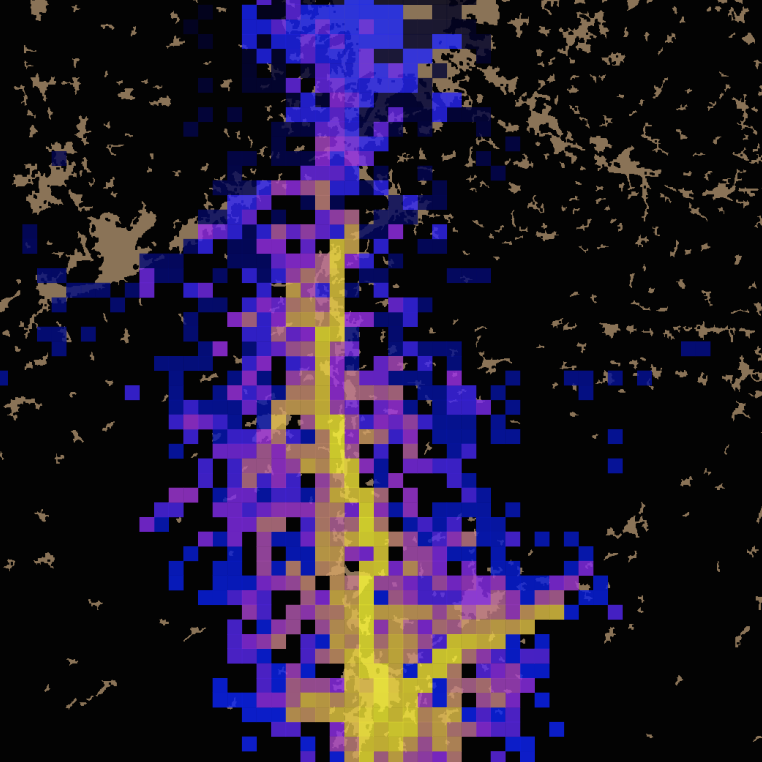

<h1 align="center">MoRIS</h1>

 

Model of Routes of Invasive Spread
 
 
&nbsp;
&nbsp;

-----------------

Human-mediated dispersal acts as a vector for many exotic species, both at the introduction and secondary spread stages. Primary and secondary introductions arise from human-mediated long distance dispersal happening at global scales. Secondary spread occurs at smaller spatial and time scales (<em>e.g.</em> landscape) and results from either natural or human-mediated dispersal. Despite the importance of materials transportation (<em>e.g.</em> landscaping, construction) for the spread of invasive species, few studies have investigated short distance human-mediated dispersal and even less have tried to model it.

  MoRIS (<em>Model of Routes of Invasive Spread</em>) is a spatially explicit spread model designed to simulate invasive species dispersal by transport at local to regional spatial scales. MoRIS is an innovative, yet simple model, taking into account the road network topology to influence the direction of dispersal events. MoRIS is designed to minimize <em>a priori</em> making (<em>e.g.</em>, expert knowledge), to enable the estimation of human-mediated dispersal parameters based on a simple presence/absence locations dataset and to produce predictive maps of spread.

  To learn how to use MoRIS, first install the <a href="https://github.com/charlesrocabert/MoRIS/releases/latest">latest release</a>, and follow the <a href="installation_instructions">installation instructions</a> and the <a href="first_usage">first usage</a> guide. MoRIS software requires input files built in a certain way. To learn how to build this files, read the <a href="https://github.com/charlesrocabert/MoRIS/blob/master/INPUT_FILES_TUTORIAL.md">input files tutorial</a>.

## Table of contents
- [Publications and communications](#publications)
- [Authors](#authors)
- [Installation instructions](#installation_instructions)
  - [Supported platforms](#supported_platforms)
  - [Dependencies](#dependencies)
  - [Software compilation](#software_compilation)
- [First usage](#first_usage)
  - [Ready-to-use examples](#examples)
  - [Run a MoRIS simulation](#run_simulation)
  - [Couple MoRIS to the optimization algorithm](#optimize)
- [Input files tutorial](#tutorial)
- [Copyright](#copyright)
- [License](#license)

## Publications and communications 
• J. M.W. Gippet, S. Fenet, A. Dumet, B. Kaufmann and C. Rocabert (2016, August). MoRIS: Model of Routes of Invasive Spread. Human-mediated dispersal, road network and invasion parameters. In <em>Proceedings of IENE 2016 conference. 5th International Conference on Ecology and Transportation: Integrating Transport Infrastructures with Living Landscapes</em> (Lyon, France). http://hal.cirad.fr/LJK_MAD_STEEP/hal-01412280v1

• J. M.W. Gippet, C. Rocabert, S. Fenet, A. Dumet and B. Kaufmann (2015, July). Modeling and evaluating human-mediated dispersal mechanisms at landscape scale: a study of road network and invasion parameters for Lasius neglectus ants invasive species. In <em>Proceedings of World Conference on Natural Resource Modeling</em> (Bordeaux, France). https://hal.archives-ouvertes.fr/hal-01242828/

## Authors 
MoRIS is being developed by <a href="https://github.com/charlesrocabert">Charles Rocabert</a>, <a href="https://jeromegippet.com/">Jérôme M.W Gippet</a> and <a href="https://perso.liris.cnrs.fr/sfenet/homepage/">Serge Fenet</a>.

#### Major contributors
* Aymeric Bonnamour

#### Other contributors
* Vivek Srivastava

<table>
    <tr>
        <td></td>
        <td></td>
        <td></td>
        <td></td>
        <td></td>
    </tr>
</table>

## Download 
Download the latest <a href="https://github.com/charlesrocabert/MoRIS-development/releases/latest">version</a>.

## Installation instructions 
Download the <a href="https://github.com/charlesrocabert/MoRIS/releases/latest">latest release</a> of MoRIS, and save it to a directory of your choice. Open a terminal and use the <code>cd</code> command to navigate to this directory. Then follow the steps below to compile and build the executables.

### Supported platforms 
MoRIS software has been successfully tested on Unix, OSX and macos platforms.

### Dependencies 
* A C++ compiler (GCC, LLVM, ...),
* CMake (command line version),
* GSL for C/C++,
* CBLAS for C/C++,
* Python &ge; 3 (Packages CMA-ES and numpy are required),
* R (**optional**, packages <code>ggplot2</code>, <code>cowplot</code> and <code>sf</code> are required).

### Software compilation 

#### User mode
To compile MoRIS, run the following instructions on the command line:

    cd cmake/

and

    bash make.sh

#### Debug mode
To compile the software in DEBUG mode, use <code>make_debug.sh</code> script instead of <code>make.sh</code>:

    bash make_debug.sh

This mode should only be used for test or development phases.

#### Executable files emplacement
Binary executable files are in <code>build/bin</code> folder.

## First usage 
One MoRIS has been installed, follow the next steps for a first usage of the software.

### Ready-to-use examples 
Ready-to-use examples are availables in the folder <code>examples</code>:

• <code>run_single_simulation.sh</code>: This script will run a single MoRIS simulation with given human-mediated dispersal parameters. You can execute it using the following command line:

    bash run_single_simulation.sh

At the end of the simulation, a figure providing an overview of the simulation result is created (<code>single_simulation.pdf</code>). You can edit the parameter values at will to test the behaviour of the model. See below for a full description of the parameters.

• <code>run_optimization.sh</code>: This script will run an optimization session by running multiple MoRIS simulation and trying to find the solution matching the experimental data at best.. You can execute it using the following command line:

    bash run_optimization.sh

You can track the ongoing optimization in the text-file <code>optimization.txt</code>. At the end of the optimization session, MoRIS writes the best parameters set in a specific file. Optimization parameters are defined in a specific file named <code>parameters.txt</code>. See below for a full description of the parameters.

### Run a MoRIS simulation 
To run one MoRIS simulation, place yourself in the folder <code>examples</code> using the <code>cd</code> command, and execute the following command line:

    ../build/bin/MoRIS_run <parameters>

### Couple MoRIS to the optimization algorithm 
<code>Under writing</code>

## Input files tutorial 
A tutorial to build MoRIS input files is <a href="https://github.com/charlesrocabert/MoRIS/blob/master/INPUT_FILES_TUTORIAL.md">available here</a>.

## Copyright 
Copyright © 2014-2020 Charles Rocabert, Jérôme M.W Gippet, Serge Fenet. All rights reserved.

## License 
This program is free software: you can redistribute it and/or modify it under the terms of the GNU General Public License as published by the Free Software Foundation, either version 3 of the License, or (at your option) any later version.

This program is distributed in the hope that it will be useful, but WITHOUT ANY WARRANTY; without even the implied warranty of MERCHANTABILITY or FITNESS FOR A PARTICULAR PURPOSE. See the GNU General Public License for more details.

You should have received a copy of the GNU General Public License along with this program. If not, see http://www.gnu.org/licenses/.
